# Wrangle — Creature Registry

**Single source of truth: [src/data/creatures.csv](../src/data/creatures.csv)** —
a real spreadsheet you can open and edit directly in Excel, Numbers, or Google
Sheets. The game parses it automatically at build time
([src/data/species.ts](../src/data/species.ts) does the parsing/validation);
no code changes are needed to add a creature.

**Row order in the CSV = dex order in the game.**

## How to add or edit a creature

1. Open `src/data/creatures.csv` in Excel/Numbers/Sheets.
2. Add or edit a row (columns below). Only `name` (or `id`) is truly
   required — every other column can be filled in later.
3. **Save it back as CSV** (in Excel: "CSV UTF-8" — keep the `.csv`
   extension, don't let it convert to `.xlsx`).
4. Drop the sprite PNG straight into `public/sprites/` — keep it named
   whatever you already call it. Leave `textureKey` blank and the game
   looks for `public/sprites/<id>.png`; if your file is named differently,
   put its exact filename (no `.png`) in the `textureKey` column, like the
   existing rows do. No sprite yet = mystery-blob placeholder.
5. Upload the changed files to GitHub as usual. Done.

Blank capture-behavior columns get gentle defaults (grazing, 3 loops,
radius 40, speed 100, no attacks), so a row with just a name and types is
immediately playable.

If a row has a mistake (typo'd value, text where a number belongs), the game
shows a descriptive error naming the creature and column — check the browser
console / Vite error overlay.

## Columns

| Column | Meaning | Blank = |
|---|---|---|
| id | Lowercase unique id. | Derived from name (letters/digits only) |
| name | Display name. | Required (or id) |
| type1 / type2 | Elemental types — used by battles from M3. type2 blank for mono-types. | none |
| hp / attack / defense / spAttack / spDefense / speed | Battle base stats (M3). | TBD |
| atkStyle | `physical` or `special` — which battle moveset it gets (M3). | TBD |
| loops | Loops to fill the capture gauge (10 pts each; base meter = 100 pts). | 10 |
| bodyRadius | Collision radius, px (sprites are ~80px, so ~40). | 40 |
| moveSpeed | Capture-arena walk speed, px/s. | 100 |
| movement | Catch behavior: `graze`, `flee`, or `charge`. | graze |
| attackPattern | `none` or `radial`. | none |
| attackIntervalMs | ms between attacks (~5000 typical). | — |
| attackDamage | **Whole health bars** removed per hit (player has 5). | 1 |
| telegraphMs | Warning time before the attack fires (~800). | 800 |
| ringMaxR / ringSpeed | Radial burst max radius (~230) / expansion px/s (~420). | 230 / 420 |
| dashIntervalMs | For `charge` movers: ms between dashes (~3500). | 3500 |
| textureKey | Exact sprite filename in `public/sprites/`, no `.png`. | uses `<id>.png` |
| blurb | Flavor text (quote it if it contains commas). | none |

## Sprite gallery

Sprites keep their original filenames in `public/sprites/`.

| dex # | name | sprite |
|---|---|---|
| 001 | Herbifuzz | 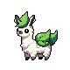 |
| 002 | Telefluff | 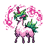 |
| 003 | Bloomancer | 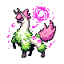 |
| 004 | Flambaa | 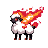 |
| 005 | Shearfire | 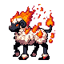 |
| 006 | Ramageddon | 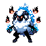 |
| 007 | Narqua |  |
| 008 | Narstream |  |
| 009 | Aquarion |  |
| 010 | Chipper |  |
| 011 | Chipunk |  |
| 012 | Fuzzark |  |
| 013 | Cocoonir | 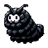 |
| 014 | Mothrae |  |
| 015 | Mothrax | 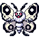 |
| 016 | Picodew |  |
| 017 | Nanodrop | 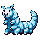 |
| 018 | Microsplash | 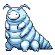 |
| 019 | Toxnome |  |
| 020 | Gnomore |  |
| 021 | Peafolia | 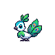 |
| 022 | Floracox | 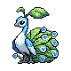 |
| 023 | Aquarix | _100x100.png) (also a [female variant](../public/sprites/Aquarix%20(Female)_80x80-2.png), unused for now) |
| 024 | Froxic | 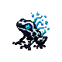 |
| 025 | Venaura | 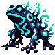 |
| 026 | Frogue | 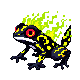 |
| 027 | Pyrotox | 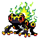 |
| 028 | Ranion |  |
| 029 | Amphivolt |  |
| 030 | Bulboak |  |
| 031 | Sapotox | 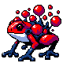 |
| 032 | Ribitta |  |
| 033 | Amphivy | 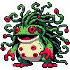 |
| 034 | Shrimpulse | 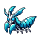 |
| 035 | Shrimlock | 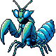 |
| 036 | Shrimpire | 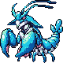 |
| 037 | Gronder | 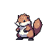 |
| 038 | Shadire | 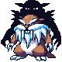 |
| 039 | Rodentia |  |
| 040 | Swordine | 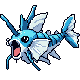 |
| 041 | Marlash | 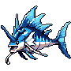 |
| 042 | Selkie | 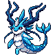 |
| 043 | Humminga | 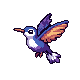 |
| 044 | Nectara | 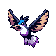 |
| 045 | Volaris |  |

Staged for later (not yet in the dex): [Mega Bloomancer](../public/sprites/Mega%20Bloomancer_80x80.png),
[Mega Ramageddon](../public/sprites/Mega%20Ramageddon_80x80.png).
